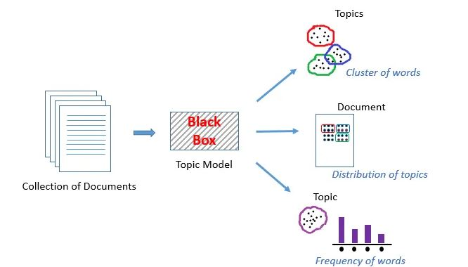
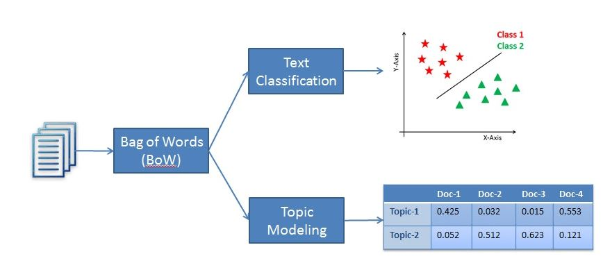
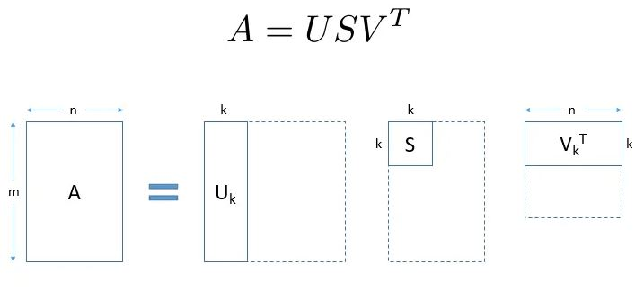

# Model-topics-from-documents-using-Latent-Semantic-Analysis
In this tutorial, you will learn how to discover the hidden topics from given documents using Latent Semantic Analysis in python.
Discovering topics which called Topic Modeling, are beneficial for various purposes such as for clustering documents, organizing online available content for information retrieval and recommendations.

Topic modeling is a text mining technique which provides methods for identifying co-occurring keywords to summarize large collections of textual information. It helps in discovering hidden topics in the document, annotate the documents with these topics, and organize a large amount of unstructured data.

In oher words, it is an unsupervised text analytics algorithm that is used for finding the group of words from the given document. These group of words represents a topic. There is a possibility that, a single document can associate with multiple themes. for example, a group words such as 'patient', 'doctor', 'disease', 'cancer', and 'health' will represents topic 'healthcare'. Topic Modeling is a different game compared to rule-based text searching that uses regular expressions.

 

### Comparison Between Text Classification and topic modeling

Text classification is a supervised machine learning problem, where a text document or article classified into a pre-defined set of classes. Topic modeling is the process of discovering groups of co-occurring words in text documents. These group co-occurring related words makes "topics". It is a form of unsupervised learning, so the set of possible topics are unknown. Topic modeling can be used to solve the text classification problem. Topic modeling will identify the topics presents in a document" while text classification classifies the text into a single class.

 

### Overview of the LSA method

### Steps involved in the implementation of LSA

Let’s say we have m number of text documents with n number of total unique terms (words). We wish to extract k topics from all the text data in the documents. The number of topics, k, has to be specified by the user.

   

    
    

